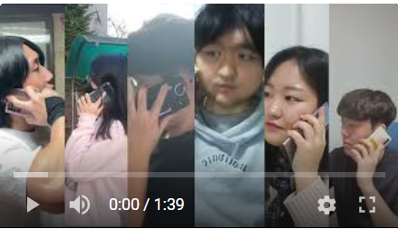
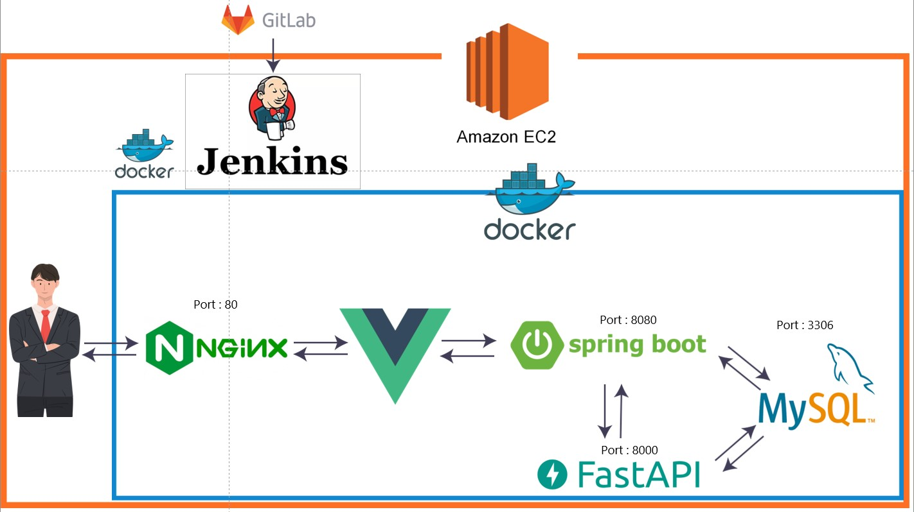
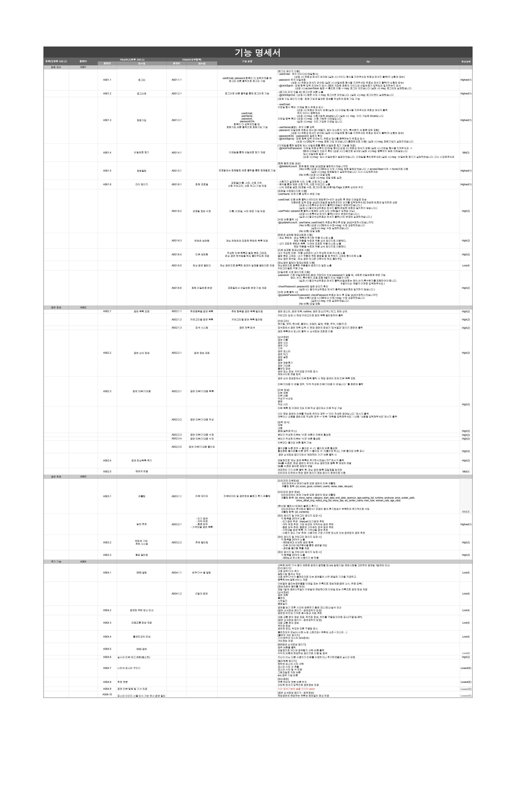
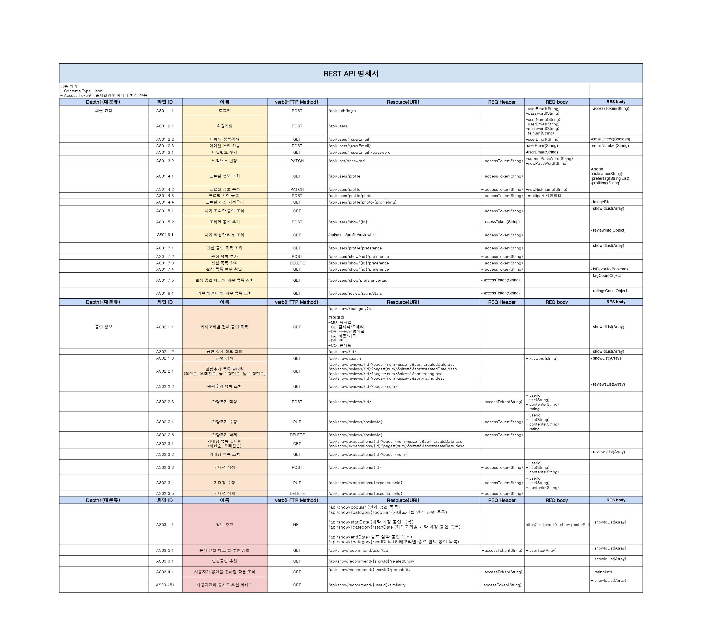
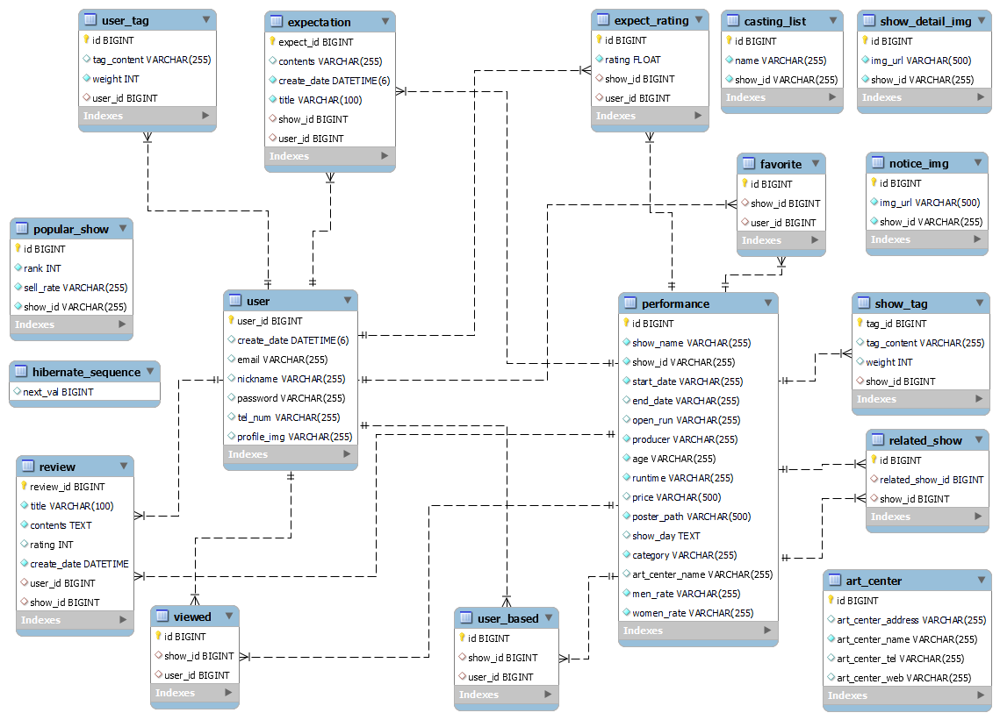
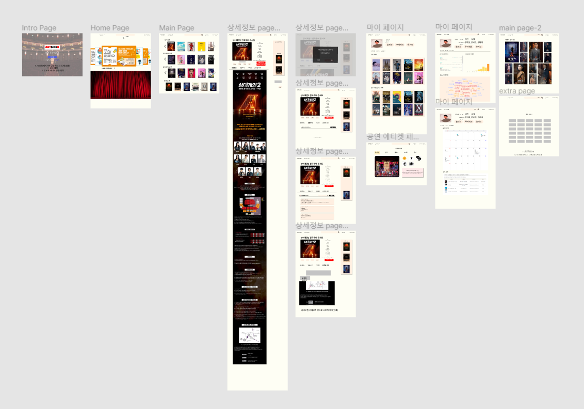

# 😎 ArtSider


------

공연계의 아웃사이더를 위한

빅데이터 기반 공연 추천 및 정보 서비스 `ArtSider` 입니다.

------

⬛ 사이트 주소

http://j6b202.p.ssafy.io/

⬛ UCC 영상

[](https://youtu.be/x4CHwLoQ7ks)

------

## 1️⃣ 문제 제기 및 프로젝트 개발 필요성

[문화관람률 데이터](https://www.index.go.kr/unify/idx-info.do?idxCd=4251 )의 통계자료를 보면 영화에 비해 다른 공연 예술들의 관람률이 굉장히 저조한 것을 알 수 있습니다.

영화관람률에 비해 공연예술은 왜 이렇게 저조한 걸까요? 사람들이 영화 이외의 공연 예술들을 접하지 않는 다양한 이유들이 있습니다. 

> - 가격 부담, 큰 도시에서 주로 공연이 이루어진다.
> - 진입 장벽이 높다.
> - 홍보 부족, 내용파악이 어렵다.

​																																																참조: [아트인사이트](https://www.artinsight.co.kr/news/view.php?no=50685)

위와 같이 여러 이유들이 있지만 주로 공연이 어떤 내용이며 재미가 있는지에 대해 정보를 쉽게 알기 어렵다는 것이 주된 의견이었습니다.

`아트사이더`는 공연 예술 관람에 대한 접근성을 높이기위해 공연에 대해 잘 알지 못하는 초심자에 주목했습니다. 

이러한 배경에서 공연 초심자를 위한 공연의 추천 및 공연 정보 제공 서비스인 `ArtSider` 를 기획하였습니다.


## 2️⃣ 프로젝트 소개

> 공연 예술에 대한 접근성을 높이고자 공연 접하는 사람들의 성향에 맞는 공연들을 추천 하기 위한 공연 추천 및 정보 서비스를 개발했습니다. 주요 추천항목은 4개입니다.

### 🌟 사용자간의 유사도 추천


👩  사용자와 비슷한 선호 작품을 가진 다른 사용자의 선호 작품을 공연 목록을 제공합니다.


### 🌟 일반 추천 및 유저 선호 태그와 유사도가 높은 공연 추천 


👩  사용자가 선호하는 태그를 바탕으로 유사도가 높은 공연을 추천합니다.

일반 추천에서는 인기 공연, 개막 예정, 종료 임박의 공연 목록들을 제공합니다.

예매율이 높은 순서대로 인기 공연 목록을 제공합니다.

오늘 날짜 기준으로 개막일자가 빠른 순으로 공연 목록을 제공합니다.

오늘 날짜 기준으로 종료일자가 빠른 순으로 공연 목록을 제공합니다.

각 카테고리별로도 별도로 제공합니다.


### 🌟 공연 관련 상세정보


#### - 사용자가 해당공연을 좋아할 확률 제공

#### - 공연과 비슷한 공연의 추천

#### - 공연의 상세정보 제공

👩  각 공연의 상세 정보를 제공합니다.


## 3️⃣ Install and Usage

> Windows 10을 기준으로 개발 환경 구성 방법을 설명한다.

### 1. OpenJDK 설치

- JDK 다운로드 사이트에서 **11 GA 버전** 설치 파일 다운로드 및 실행

  - OpenJDK 공식 웹사이트 : https://jdk.java.net/archive/

- 명령 프롬프트(cmd) 확인

  ```bash
  $ java -version
  openjdk version "11" 2018-09-25
  OpenJDK Runtime Environment 18.9 (build 11+28)
  OpenJDK 64-Bit Server VM 18.9 (build 11+28, mixed mode)
  ```


## 2. DB 구성

> 이미 설치되어 있거나 원격 DB를 사용하는 경우 설치 부분 생략

- MySQL 사이트에서 **Windows (x86, 32-bit), MSI Installer (435.7M)** 설치 파일 다운로드 및 실행

  - MySQL 공식 웹사이트 : https://dev.mysql.com/downloads/mysql/

- 명령 프롬프트(cmd) 확인

  ```bash
  $ mysql --version
  ```

- dump.sql 파일 실행하여 DB 생성

### 2. Python 설치

- **Python v3.8**로 설치

  - Python 공식 웹사이트 : https://www.python.org/downloads/

- 명령 프롬프트(cmd) 확인

  ```bash
  $ python -V
  Python 3.8.10
  ```

### 3. 프로젝트 다운로드

- 프로젝트 다운로드

  ```bash
  git clone <repo URL>	
  ```

- `{origin_DIR}/backend/backSpring/src/main/resources/application.properties`로 이동

  - 자신의 환경에 맞게 DB 설정

- `{origin_DIR}/backend/backSpring/src/main/java/com/ssafy/myapp/api/service/ShowServiceImpl.java`로 이동

  - **findUserBasedRecommend**메소드에서 **baseURL**을 `127.0.0.1:8000`으로 수정


### 4. Python 가상환경 생성 및 라이브러리 설치

- `{origin_DIR}/backend/fastApi/`로 이동

  ```bash
  $ pip3 install virtualenv
  $ python -m venv .venv
  $ source .venv/Scripts/activate
  
  $ pip3 install --upgrade pip
  $ pip3 install -r requirements.txt
  ```

- 형태소 분석기 mecab 설치

  https://uwgdqo.tistory.com/363를 참고하여 **mecab**을 설치한다.

- fastApi 프로젝트 실행

  ```bash
  $ uvicorn app.main:app
  ```

### 5. Frontend 설치 및 실행


1. frontend 폴더로 이동

   ```bash
   cd <folder-name>/frontend
   ```

2. 패키지 설치

   ```bash
   npm install
   ```

3. 프로젝트 실행

   ```bash
   npm run serve
   ```


## 4️⃣ 추천 서비스 개발 플로우

### ⭐ 아키텍처



### ⭐공연/유저별 태그정보 기반 추천

#### 관련공연- "ooo 공연과 비슷한 공연 추천"

#### 개발 플로우

1. 모든 공연의 리뷰에서 어떤 키워드가 많이 추출 되는지 확인하고 추출 및 사전화
2. “000” 공연과 일치하는 공연 카테고리(ex 뮤지컬,연극,클래식)로 먼저 필터링
3. 형태소 분석한 “000” 공연의 리뷰 키워드를 사전화된 키워드와의 공연 별 태깅
4. 공연간의 태그 유사도를 계산하여 비슷한 공연 작품 제시


#### 유저선호태그를 활용한 추천 서비스

#### 개발 플로우

1. 공연별 태깅
2. 사용자의 관심공연 각각이 가지는 태그를 활용해서 유저선호태그 추출
3. 유저 선호태그와 공연간의 태그 유사도를 계산하여 가장 비슷한 공연 작품 제시 


#### 키워드 추출 및 사전화 

- 리뷰데이터의 띄어쓰기와 맟춤법 교정 

- 리뷰데이터의 형태소 분석

  

  - **okt vs mecab** : okt가 정확도 및 형태소분석이 자세해 좋지만 시간이 너무 오래걸려 mecab으로 진행

- 불용어(사용하지 않는 단어) 정의

- 결과


#### 유사도 분석 및 추천

- 코사인 유사도  분석
  - 공연 vs  공연 간의 유사도 분석
  - 유저 vs 공연 간의 유사도 분석


### ⭐사용자간 유사도 기반 추천

#### 개발 플로우

1. 모든 공연에 대해 작성한 리뷰의 평점과 유저정보를 가져옵니다.
2. 해당공연에 유저가 준 평점을 통해 모든 유저간 유사도를 구합니다.
3. 추천 받고자 하는 유저a의 정보를 통해 해당 유저와 같은 공연에 비슷한 평점들을 준 유저를 찾습니다.
4. 가장 유사한 유저 순서대로 유저a가 본 공연을 제외한 후 추천 목록에 추가 하도록 합니다.(최대 10개)

- scikit-learn

  

  - 데이터 마이닝 및 분석에 필요한 효과적인 기능을 제공합니다.
  - Numpy 및 Scipy로 만들어졌으며, 분류, 클러스터링, 차원 축소, 회귀 등 다양한 머신러닝 기법을 제공합니다.
  - 코사인 유사도 계산시 이용합니다.

- 코사인 유사도
  
  
  
  - 두 벡터 사이의 코사인 각도를 구해 서로의 유사도를 구하는 방식이며 데이터 크기의 차이에 관계없이 유사도를 비교할 수 있습니다.
  - 데이터의 크기에 관계없이 각도로만 판단하기 때문에 데이터셋 의 차이가 나더라도 유사도를 판단 할 수 있다.
  
  

### ⭐KNN 알고리즘으로 예측 평점 제공

#### 개발 플로우

1. 모든 사용자들의 모든 공연별 리뷰 점수, 각 공연 id를 불러옵니다.

2. k값을 선정하고 knn알고리즘을 통해 사용자의 정보와 인접한 k개의 데이터로 분석합니다.

3. 결과로 나온 예상평점을 예상평점10*100%로 계산하여 확률을 구합니다.

   (예시 : 000님이 000공연을 좋아할 확률은 00%입니다.)

#### KNN(K- 최근접 이웃)


: 어떤 데이터가 주어지면 그 주변의 데이터를 살펴본 뒤 많은 데이터가 포함되어있는 범주로 분류하는 방식

- 특징들이 가장 유사한 k개의 레코드를 찾음
- 유사한 레코드들의 평균을 찾아서 새로운 레코드에 대한 예측값으로 사용
- 적절한 k값을 찾아야함 

#### 가장 적합한 k값 구하기

- K=3 가장 가까운 주변의 3개 데이터를 본 뒤, 3개의 주변데이터가 더 많이 포함되어있는 범주로 분류하겠다는 뜻
- K가 너무 작으면 데이터의 노이즈 성분까지 고려하는 과대적합 문제발생
- k를 너무 크게 하면 결정함수가 너무 과하게 평탄화되어 데이터의 지역 정보를 예측하는 KNN의 기능을 잃어버림
- 노이즈가 거의 없고 아주 잘 구조화된 데이터의 경우 k값이 작을수록 잘 동작
- 노이즈가 많은 데이터의 경우 k가 클수록 좋다.
- 보통 1-20사이에 놓으며 동률이 나오는 경우를 막기 위해 보통은 홀수 사용


- 적합한 K값을 구하기 위해 1-50까지의 k값을 넣은 후 결과값의 차이를 시각화하여 적합한 K값 선정.
- 위의 그래프는 결과값의 차이값을 시각화한 그래프로 하강한후 비교적 일정한 차이를 유지하는 15를 선정

#### 피어슨 유사도와 예측확률 계산


- 피어슨 유사도로 리뷰기준으로 유사한 사용자 15명(K) 선정
- 유사도가 높은 사용자들의 각 공연별 평균평점계산
- 예상평점10*100%로 계산하여 확률 제공


## 5️⃣ 일정

> 빠르게 웹사이트 기본 기능을 구현하고, 2명씩 페어로 추천 알고리즘을 구현하는 전략
>
> | 일정                           | 진행 내용                                                    |
> | ------------------------------ | ------------------------------------------------------------ |
> | **1주차(2월 28일 ~ 3월 4일)**  | - 팀빌딩<br />- 개발환경 설정<br />- 빅데이터-추천알고리즘 학습<br />- 아이디어 기획<br />- 그라운드 룰 회의 |
> | **2주차(3월 7일 ~ 3월 11일)**  | - 주제 선정  <br />- 공연 추천 플랫폼 (이름 : ArtSider) <br />- 팀원 역할 분배 협업 채널 논의  (Jira /MM /Discord /Notion) <br />- 기능 명세서 <br />- 웹사이트 디자인 컨셉 <br />- User-Flow ERD 와이어 프레임 <br />- 전문가 리뷰 <br />- 4차도메인 학습 및 공유 (라이브러리 학습 / 프레임워크 학습 / 추천알고리즘 학습) |
> | **3주차(3월 14일 ~ 3월 18일)** | - RestAPI 명세서 작성 <br />- 와이어프레임 빌드업 <br />- 추천 항목 /기능 확정 <br />- 데이터 수집  (공연정보 크롤링& API / 공연 리뷰 크롤링) <br />- 개발환경 세팅 <br />- 서버 배포 및 빌드 테스트 <br />- 기획 발표/평가 |
> | **4주차(3월 21일 ~ 3월 25일)** | - 기능 명세서 및 RestAPI 수정<br />- 데이터 추천 서비스에서 활용할 사전 구축<br />- 기본 기능 구현  <br />         `Front-end`  <br />                    회원관리 <br />                    메인화면 <br />                    공연 상세페이지 <br />                    리뷰/ 기대평   <br />         ` Back-end`  <br />                    공연정보 Rest API <br />                    리뷰 Rest API <br />                    회원관리 Rest API <br />                    크롤링한 데이터 DB에 저장 |
> | **5주차(3월 28일 4월 1일)**    | -기본 기능 구현<br />         `Front-end`  <br />                    프로필<br />                    에티켓화면<br />                    RestApi 연결 <br />         ` Back-end`  <br />                    프로필 Rest API <br />                    추천 항목 Rest API <br />                    공연 검색Rest API <br />                    기대평 Rest API <br />- 추천 알고리즘 구현 |
> | **6주차(4월 4일 ~ 4월 8일)**   | - 기능 테스트 및 디버깅 <br />- 서버 최종 배포 <br />- 산출물 정리 <br />- UCC 촬영 및 편집 <br />- 최종 발표 |
>
> 


## 6️⃣ 기능 명세 요구 사항 정의서



## 7️⃣ REST API



## 8️⃣ ERD




## 9️⃣ 와이어 프레임




## :keycap_ten:  Coding Convention

### 📐 Language Convention

- Spring :   [백엔드 코딩 컨벤션](https://www.notion.so/88d86bf8b7b943e78a835d72130d4432)

- Vue :  [프론트엔드 코딩 컨벤션](https://www.notion.so/3ad6d1bf0c894322872a9fe6940c6dac)

  

### 📐 Commit Message Convention

- Git 컨벤션: [Git 컨벤션](https://www.notion.so/f8b4637a74af411f98575e9a958a9b60)

  | 태그이름 | 설명                                               | 예시                       |
  | -------- | -------------------------------------------------- | -------------------------- |
  | Feat     | 기능 관련 추가/수정하는 경우                       | 로그인 기능 추가           |
  | Fix      | 버그 수정                                          | 버그 수정(FE/BE 매치 실패) |
  | Design   | CSS 등 사용자 UI디자인 변경                        | 버튼 UI변경                |
  | Docs     | 문서를 수정한 경우                                 | README 수정                |
  | Rename   | 파일 혹은 폴더명을 수정하거나 옮기는 작업만인 경우 | 디렉토리명 변경            |
  | Remove   | 파일을 삭제하는 작업만 수행한 경우                 | 삭제                       |
  | Comment  | 필요한 주석 추가 및 변경                           | API 설명 추가              |
  | Refactor | 코드 리팩토링                                      | 로그인 함수 리팩토링       |
  | Chore    | 사소한 수정/ 잡일을 수행하는 경우                  | 변수명 변경                |

  

- **TITLE**

  - **Rules**

    a. 한글 문장으로 적기 

    b. 문장을 **명사**나 **명사형으로만** 간략하게 적기(개조식 문장) 

    c. 마지막 **특수문자 사용금지** 예) 마침표(.), 느낌표(!), 물음표(?), 언더바/하이픈(_/-) 

    d. **50자 이내**로 작성

    

- **BODY**

  ​		a. 본문은 **한 줄 당 72자 내**로 작성합니다. 

  ​		b. 본문 내용은 양에 구애받지 않고 **최대한 상세히 작성**합니다. 

  ​		c. 본문 내용은 **어떻게 변경했는지** 보다 **무엇을 변경했는지** 또는 **왜 변경했는지** 를 설명합니다.

  

  ```
   git commit -m “Feat(FE/BE): 로그인 화면 추가”
   git commit -m “Docs(FE/BE): 사용설명서 추가”
  ```

  

### 📐 Jira Epic

| 이름          | 내용                                                 |
| ------------- | ---------------------------------------------------- |
| 기획          | 기획서, 명세서, 요구사항 정리, 문서 작성             |
| DATA          | 데이터 전처리 및 추천 알고리즘 처치 등               |
| Project       | 백엔드, 프론트엔드 REQ&RES, DB스키마, 데이터 처리 등 |
| Design        | 와이어 프레임, 프로토타입, 화면 구성, 레이아웃 배치  |
| 배포 및 CI/CD | 배포, action, jenkins, CI/CD 등                      |
| 발표          | PPT 제작, 발표 연습, 시연 영상 찍기 등의 발표 준비   |
| UCC           | UCC 스토리보드  제작, UCC 제작 회의 및 촬영          |
| Docs          | Readme, 기타 제출해야 할 문서 작성                   |


## 👪 팀 소개


### 👼 팀원 소개

> | 소개  | 이름   | 역할          | Github                           |
> | ----- | ------ | ------------- | -------------------------------- |
> | 🐻팀장 | 김정윤 | 프로젝트 총괄 | https://github.com/KJY97         |
> | 🐨팀원 | 김순요 | 서기          | https://github.com/KSoonYo       |
> | 🐯팀원 | 김치우 | JIRA 관리자   | https://github.com/ChiwooKim     |
> | 🐱팀원 | 남궁휘 | 발표          | https://github.com/whiterabbit7  |
> | 🐰팀원 | 한승훈 | 회의 진행자   | https://github.com/gkstmdgns422  |
> | 🦝팀원 | 황보라 | 노션 관리자   | https://github.com/yellow-purple |

### 🌴 Front end

- **김순요(FE 파트장 frontend)**
  - 리뷰 데이터 사전화 작업
  - 태그 기반 관련공연 추천 구현
  - 페이지 디자인
  - 홈화면 캐로셀 디자인 구현
  - 홈/메인화면/프로필/공연 리스트 /회원관리 /검색 화면 구현
  - 유저 데이터 시각화: 태그 워드 클라우드 및 차트 구현
- **남궁휘 (팀원, frontend)**
  - 발표 /UCC 제작
  - 데이터 분석
  - 사용자 간 유사도 기반 추천 서비스 구현
  - 공연 에티캣 페이지(에티켓 정보 구현)
  - 로고 등 디자인 담당
- **한승훈(팀원, frontend)**
  - 추천알고리즘 전체 설계
  - 리뷰 데이터 사전화 작업
  - 공연에 대한 사용자 예상 평점 구현  
  - 공연 상세 페이지(공연정보, 관람후기, 기대평) 구현
  - 카카오맵을 활용한 공연장 위치 및 주변활동 서비스 구현
  - 페이지 디자인


### 🛤 Back end

- **김정윤(총 팀장, backend)**
  - CI/CD 구축 및 관리
  - 리뷰 데이터 사전화 작업 
  - 유저 선호태그 공연 추천 구현
  - 리뷰관리 RestApi 구현
  - 기대평 관리 RestApi 구현
  - fastApi와 Spring 간의 데이터 통신
  - DB 설계 및 구축
  
- **황보라(BE 파트장, backend)**
  - 회원관리  RestApi 구현
  - 프로필 관리 RestApi 구현
  - 공연 리뷰 크롤링 및 저장 
  - 공연에 대한 사용자 예상 평점 구현 
  - DB 설계 및 구축
  
- **김치우(팀원, backend)**
  - 공연 조회 RestApi 담당
  - 공연 정보/공연장 정보 크롤링 및 저장 
  - 사용자 간 유사도 기반 추천 서비스 구현
  - 데이터 분석
  - DB설계 및 구축
  
  

## ❤ 소감

**김정윤**: 이전 프로젝트에서 사용하지 못해서 아쉬웠던 JPA를 이번 프로젝트에서 사용하면서 ORM 방식으로 개발하는 경험하고 학습하는 시간이었습니다. 또 팀원분들이 학습한 내용에 대해 많이 공유해주셔서 큰 부담없이 프로젝트를 진행할 수 있었습니다. 좋은 팀원분들을 만나서 정말 좋았고 모두 7주간 수고하셨습니다!

**김순요**: 혼자라면 6주 안으로 절대 할 수 없는 프로젝트였습니다. 과분하게도 프론트앤드 파트장을 맡았는데, 파트장으로서 팀원들에게 더 많은 도움을 주지 못한 것 같아 아쉽습니다. 그래도 팀원들과 함께 진행하면서 제가 알고 있던 부분은 더 확실하게 짚고 넘어갈 수 있었고, 미처 몰랐던 부분도 함께 조사하면서 알아갈 수 있었습니다. 구현해야하는 기능이 많았던 데다 백엔드와 서버 통신도 제대로 되지 않아서 우여곡절이 많았지만, 다 끝나고 돌아보니 그 경험들이 모두 공부의 과정이었던 것 같습니다. 좋은 마무리를 할 수 있도록 함께 힘내주신 팀원들에게 감사하다는 말씀 드리고 싶습니다. 😀

**김치우**: 특화 프로젝트 기간 동안 팀원분들에게 많은 것들을 배웠고 작업과정들이 재밌었습니다. 또한 이번 프로젝트 때 BE를 담당하면서 spring, java를 공부를 시작하고 다뤄보게 되었습니다. 사실 구현 부분이 다른 분들에 비해 쉬운 부분이었지만, 잘 해내지 못할까봐 걱정도 많이 했습니다. 하지만 궁금한 점들을 같은 BE 담당이신 정윤님, 보라님이 매번 잘 알려주셔서 공부도 많이 되었고, 제가 맡은 부분들을 다 구현할 수 있었습니다.  마지막주 다들 달리시느라 고생 많으셨고 프로젝트 기간동안 정말 재밌고 감사했습니다.

**남궁휘**: 특화 프로젝트를 진행하면서 좋은 팀원분들 만나서 즐겁게 작업 한 것 같습니다. 저만 그런가? 저만 그럴 수도 있습니다. 다른 분들은 좀 답답하셨을 수도 있는데 ; 그렇게 생각하니 좀 죄송하네요. 프로젝트 마무리 잘 하고 다음에도 또 뵀으면 좋겠습니다. ARTSIDER팀 화이팅! !💪

**한승훈**: 프로젝트를 통해 빅데이터 도메인을 접해볼 수 있어서 좋았습니다. 그리고 이번엔 기능과 컨텐츠 양에 맞춰 서비스를 구현하려다 보니 많이 배울 수 있어 좋았습니다. 항상 친절하게 알려주시고 문제가 생기면 다같이 관심을 가져주는 우리팀(정윤님, 보라님, 치우님, 휘님, 순요님)! 너무 감사합니다. 현직에서도 만났으면 좋겠습니다~~~

**황보라**: 이번 프로젝트를 하면서 저번 프로젝트보다 더 많은 기능들을 구현하며 스프링에 대해 많이 학습할 수 있는 시간이었습니다. 궁금한것이 있으면 언제든 물어볼 수 있는 팀원분들이 있어서 큰 부담 없이 재미있게 진행한 프로젝트였습니다. 팀원분들 모두 수고하셨습니다!🎉🎉🎉
